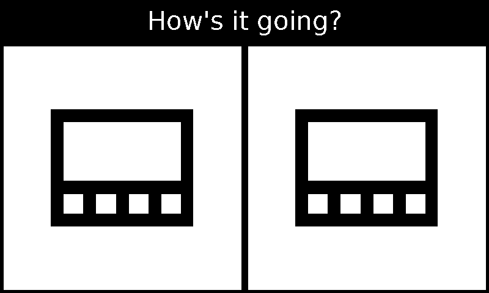

# E-Paper User Interface

A complete, flexible, and easy-to-use user interface designed
for e-paper displays

## Contents

1. [Before Start - Library Info](#before-start)
2. [Example - Quickstart](#getting-started)
3. [Methodology - Layout and Scale](#basic-methodology)
4. [Further Insight - View Gallery](#go-further)

## Before Start

If you have a e-ink or grayscale display, this is the right option

This library is designed for low refresh rate displays, but can also
be fine-tuned to work with higher ones

However, if you don't like python or pillow (as a dependency),
go ahead and write your own one

## Getting Started

Here's an example

```python
import resources
from ui import *

CANVAS_SIZE = (800, 480)


def main():
    image = Image.new('L', CANVAS_SIZE, 255)  # a greyscale image
    draw = ImageDraw.Draw(image)  # create a canvas
    context = Context(draw, CANVAS_SIZE)
    vgroup = VGroup(context,  # vertical group is where subviews are laid vertically
                    alignment=ViewAlignmentHorizontal.CENTER,
                    prefer=ViewMeasurement.default(
                        width=ViewSize.MATCH_PARENT,
                        height=ViewSize.MATCH_PARENT
                    ))
    header = Group(context,  # a simple group is where subviews are anchored on the same pot
                   prefer=ViewMeasurement.default(
                       width=ViewSize.MATCH_PARENT,
                       height=70  # 70px
                   ))
    content = HGroup(context,
                     prefer=ViewMeasurement.default(
                         width=ViewSize.MATCH_PARENT,
                         height=ViewSize.MATCH_PARENT
                     ))
    """
    view tree:
    root
    ├── vgroup
    │   ├── header: Group
    │   │   ├── Surface
    │   │   └── TextView
    │   └── content: HGroup
    │       ├── ImageView
    │       └── ImageView
    """
    context.root_group.add_view(vgroup)
    vgroup.add_view(header)
    vgroup.add_view(content)

    header.add_view(
        Surface(
            context,
            prefer=ViewMeasurement.default(
                width=ViewSize.MATCH_PARENT,
                height=ViewSize.MATCH_PARENT
            )
        )
    )
    header.add_view(
        TextView(
            context,
            text="How's it going?",
            font_size=24,
            fill=255,  # white to be visible over black header
            align_horizontal=ViewAlignmentHorizontal.CENTER,
            prefer=ViewMeasurement.default(
                width=ViewSize.MATCH_PARENT,
                height=ViewSize.WRAP_CONTENT,
                margin_top=20
            )
        )
    )
    vgroup.add_view(
        View(context,
             prefer=ViewMeasurement.default(
                 width=ViewSize.MATCH_PARENT,
                 height=ViewSize.MATCH_PARENT
             ))
    )
    content.add_view(
        ImageView(context,
                  image=resources.get_image('view-gallery'),
                  prefer=ViewMeasurement.default(
                      size=0.5
                  ))
    )
    content.add_view(
        ImageView(context,
                  image=resources.get_image('view-gallery'),
                  prefer=ViewMeasurement.default(
                      size=0.5
                  ))
    )
    render(context)


if __name__ == "__main__":
    main()
```

To test it on your computer,
```python
from ui import *

def render(context: Context, image: Image.Image):
    context.redraw_once()
    image.show()
```

To run it on your MCU,
```python
from ui import *

def render(context: Context, image: Image):
    context.on_redraw(lambda: epd.display(image)) # use your epd driver or something
    context.start() # blocks the current thread to make sure the UI is responsive
```

You should get a render like this



## Go Further

### Basic methodology

The drawing space is abstracted as layouts, splitting the whole area
into several smaller ones to organize complex information and relationships

Following are predefined lay-outing methods

- Group: just stack
- VGroup: place linearly and vertically
- HGroup: place linearly and horizontally

They coordinate margins and spaces, the process of which is called measure,
in order to decide where the child views are positioned and how big they are

Each layout method has its own way of measuring, while sharing the same logic

- Keep margin. Margins are preferably user-defined unless there's no space left
- Least space. Each child view takes the least possible space unless asked to scale up
- Left to right, top to bottom, background to foreground

### View gallery

Following are views that have been implemented

- View
> Something that can be drawn on the screen
> 
> By default, a plain View object draws nothing unless `View.draw_bounds_box` is overridden
- Group
- VGroup
- HGroup
- TextView
- Surface
> Surface is a view that displays pure color
- ImageView
> A view that shows a static view of image
- ChartsView
> The base class for all charts view
- TrendChartsView
> A ChartsView that only shows a trendy line
- MiniWeatherView
- LargeWeatherView
- WeatherTrendView
> A large view that contains a charts and its corresponding weather condition
- CalenderStripeView
> A view that displays a single event in high contrast
- CalendarView
> A CalendarView is a vertical list of `CalendarStripeView` to display a series of events

## Credits
 - [qwd/Icons](https://github.com/qwd/Icons) for weather icons.

## License
```
The MIT License (MIT)

Copyright (c) 2023 zhufucdev

Permission is hereby granted, free of charge, to any person obtaining a copy
of this software and associated documentation files (the "Software"), to deal
in the Software without restriction, including without limitation the rights
to use, copy, modify, merge, publish, distribute, sublicense, and/or sell
copies of the Software, and to permit persons to whom the Software is
furnished to do so, subject to the following conditions:

The above copyright notice and this permission notice shall be included in
all copies or substantial portions of the Software.

THE SOFTWARE IS PROVIDED "AS IS", WITHOUT WARRANTY OF ANY KIND, EXPRESS OR
IMPLIED, INCLUDING BUT NOT LIMITED TO THE WARRANTIES OF MERCHANTABILITY,
FITNESS FOR A PARTICULAR PURPOSE AND NONINFRINGEMENT. IN NO EVENT SHALL THE
AUTHORS OR COPYRIGHT HOLDERS BE LIABLE FOR ANY CLAIM, DAMAGES OR OTHER
LIABILITY, WHETHER IN AN ACTION OF CONTRACT, TORT OR OTHERWISE, ARISING FROM,
OUT OF OR IN CONNECTION WITH THE SOFTWARE OR THE USE OR OTHER DEALINGS IN
THE SOFTWARE.

```